# 8 PUZZLE 🧩
---
## 📑 MỤC LỤC

[Mục tiêu](#mục-tiêu)  
[Giới thiệu](#giới-thiệu)  
[Nhóm thuật toán](#nhóm-thuật-toán)  
   - [Tìm kiếm không có thông tin](#tìm-kiếm-không-có-thông-tin)  
   - [Tìm kiếm có thông tin](#tìm-kiếm-có-thông-tin)  
   - [Tìm kiếm cục bộ](#tìm-kiếm-cục-bộ)  
   - [Tìm kiếm có ràng buộc](#tìm-kiếm-có-ràng-buộc)  
   - [Tìm kiếm trong môi trường phức tạp](#tìm-kiếm-trong-môi-trường-phức-tạp)  
   
[Kết luận](#kết-luận)  
[Kết quả và trực quan hóa](#kết-quả-và-trực-quan-hóa)  
---

## 🧭 MỤC TIÊU

Mục tiêu của đồ án này là áp dụng các thuật toán Trí tuệ Nhân tạo để giải quyết bài toán trò chơi 8 ô chữ (8-puzzle). Thông qua đó, nhóm tìm hiểu và so sánh hiệu quả của các thuật toán tìm kiếm không có thông tin, có thông tin, thuật toán cục bộ, ràng buộc, và học tăng cường trong việc giải quyết một bài toán cụ thể.


## 👋 GIỚI THIỆU
Bài toán 8-Puzzle là bài toán cổ điển trong AI, yêu cầu đưa trạng thái ban đầu của một bảng 3x3 gồm các số từ 1 đến 8 và một ô trống về trạng thái mục tiêu bằng cách trượt các ô theo các bước hợp lệ.
Dự án này triển khai và so sánh hiệu năng (thời gian, số bước đi) giữa các thuật toán, được phân thành **6 nhóm chính** trong lĩnh vực Trí tuệ nhân tạo:

## 📝 CÁC NHÓM THUẬT TOÁN
### 1. Tìm kiếm không có thông tin (Uninformed Search)
Đây là lớp thuật toán duyệt không dùng heuristic, khám phá không gian trạng thái thuần túy.

#### BFS (Breadth-First Search)
- **Nguyên lý**: Khởi tạo hàng đợi (FIFO) chứa trạng thái gốc. Lặp: lấy trạng thái đầu, kiểm tra đích, nếu không thì mở rộng toàn bộ con (các bước hợp lệ) và thêm vào cuối hàng đợi.
- **Độ phức tạp**: Thời gian và không gian O(b^d), b là số bước khả dĩ (thường 2–4), d là độ sâu lời giải.
- **Phân tích**:
  - Khi d nhỏ (<20), BFS tìm nhanh lời giải ngắn nhất.
  - Với d tăng, bộ nhớ tăng theo cấp số nhân, nhanh chóng không khả thi.
- **Ví dụ**: Tìm từ [1 2 3; 4 5 6; 7 8 _] đến mục tiêu mất 12 bước thì phải lưu rất nhiều trạng thái trung gian.

#### DFS (Depth-First Search)
- **Nguyên lý**: Dùng ngăn xếp (LIFO) hoặc đệ quy để đi sâu càng xa càng tốt trước khi quay lui.
- **Độ phức tạp**: Thời gian O(b^m) (m là độ sâu tối đa cho phép), không gian O(b·m).
- **Phân tích**:
  - Tốn ít bộ nhớ (chỉ lưu đường dẫn hiện tại + siblings chờ thăm).
  - Dễ rơi vào nhánh sâu vô hạn nếu không giới hạn độ sâu.
  - Khi kết hợp giới hạn độ sâu (DFS giới hạn), có thể tìm lời giải nhưng không đảm bảo tối ưu.

#### UCS (Uniform Cost Search)
- **Nguyên lý**: Dùng hàng đợi ưu tiên theo chi phí tích lũy g(n). Mỗi nút được đánh dấu f = g(n), luôn mở rộng nút có f nhỏ nhất.
- **Độ phức tạp**: O(b^(1+⌊C*/ε⌋)), với C* chi phí lời giải tối ưu và ε chi phí nhỏ nhất (ở bài 8-Puzzle thường ε=1).
- **Phân tích**:
  - Tìm lời giải có chi phí thấp nhất (khi mỗi bước có trọng số khác nhau).
  - Tiêu tốn bộ nhớ tương tự BFS khi chi phí đồng nhất.

#### IDS (Iterative Deepening Search)
- **Nguyên lý**: Kết hợp ưu điểm của BFS và DFS. Lặp i từ 0 đến d_max: chạy DFS giới hạn độ sâu i. Khi tìm được, dừng.
- **Độ phức tạp**: Tổng chi phí lặp lại ~ b^d (gần bằng BFS) nhưng không gian O(b·d).
- **Phân tích**:
  - Giảm bộ nhớ mạnh so với BFS.
  - Chi phí lặp lại các tầng nhỏ không đáng kể khi d lớn.

---
### 2. Tìm kiếm có thông tin (Heuristic Search)
Sử dụng hàm heuristic h(n) ước lượng chi phí còn lại từ trạng thái n đến mục tiêu.

#### A* Search
- **Nguyên lý**: Tính f(n)=g(n)+h(n). Dùng hàng đợi ưu tiên mở rộng nút có f nhỏ nhất.
- **Yêu cầu**: Heuristic phải **admissible** (không vượt quá chi phí thật) và **consistent** (thỏa tính tam giác).
- **Độ phức tạp**: Tốt nhất O(d), tệ nhất O(b^d).
- **Phân tích**:
  - Hai heuristic phổ biến:
    - **Misplaced Tiles**: số ô sai vị trí.
    - **Manhattan Distance**: tổng khoảng cách Manhattan giữa vị trí hiện tại và vị trí mục tiêu.
  - Với Manhattan, tìm giải tối ưu nhanh hơn đáng kể.

#### IDA* (Iterative Deepening A*)
- **Nguyên lý**: Tương tự A* nhưng dùng DFS, lặp với ngưỡng f_limit ban đầu = h(root). Mỗi lần tăng threshold lên min f vượt ngưỡng trước đó.
- **Độ phức tạp**: Tiết kiệm bộ nhớ O(b·d), thời gian lặp lại nhưng gần hiệu quả A*.
- **Phân tích**:
  - Thích hợp với bộ nhớ hạn chế.

#### Greedy Best-First Search
- **Nguyên lý**: Chỉ dùng h(n), mở rộng nút có h nhỏ nhất.
- **Phân tích**:
  - Rất nhanh với heuristic mạnh.
  - Không đảm bảo tìm lời giải tối ưu; dễ đi vào đường cụt nếu heuristic không chuẩn.

---
### 3. Tìm kiếm cục bộ (Local Search)
Không duyệt cây trạng thái hoàn toàn; chỉ duyệt quanh nghiệm hiện thời.

#### Simple Hill Climbing
- **Nguyên lý**: Từ trạng thái S, kiểm tra các lân cận, chuyển đến trạng thái hấp dẫn nhất (h giảm nhiều nhất).
- **Nhược**: Dễ kẹt tại cực tiểu địa phương hoặc plateau.

#### Steepest Ascent Hill Climbing
- **Nguyên lý**: Thăm tất cả lân cận, chọn chuyển đến trạng thái cho cải thiện lớn nhất.
- **Cải tiến**: Giảm rủi ro chọn cận tối ưu kém nhưng vẫn có thể kẹt.

#### Stochastic Hill Climbing
- **Nguyên lý**: Chọn ngẫu nhiên một lân cận có cải thiện, không chọn bước tốt nhất chắc chắn.
- **Lợi**: Đa dạng hoá đường đi, giảm bớt kẹt.

#### Simulated Annealing
- **Nguyên lý**: Tại nhiệt độ T, được phép chấp nhận bước xấu Δh>0 với xác suất exp(-Δh/T). T giảm dần theo schedule.
- **Lợi**: Cơ hội thoát cực trị cục bộ.
- **Chú ý**: Lập lịch làm lạnh (cooling schedule) quyết định hiệu quả.

#### Beam Search
- **Nguyên lý**: Giữ một beam_size trạng thái tốt nhất tại mỗi bước, chỉ mở rộng chúng.
- **Đặc điểm**: Kiểm soát được bộ nhớ, nhưng nếu beam_size quá nhỏ có thể bỏ sót đường đi tốt.

#### Genetic Algorithm
- **Nguyên lý**: Khởi tạo quần thể cá thể (mỗi cá thể là chuỗi hoán vị). Qua các thế hệ: chọn lọc theo fitness (heuristic), lai ghép (crossover), đột biến (mutation).
- **Ưu**: Khám phá đa hướng, phù hợp với không gian lớn.
- **Cần lưu ý**: Chọn tỉ lệ đột biến, crossover, kích thước quần thể đúng mức.

---
### 4. Tìm kiếm có ràng buộc (Constraint Satisfaction)
Bài toán mô hình biến X_i với miền D_i và tập ràng buộc C.

#### AC-3
- **Nguyên lý**: Duy trì hàng đợi các cặp (X_i,X_j). Lặp: loại giá trị x∈D_i nếu không tồn tại y∈D_j sao cho (x,y) thỏa ràng buộc. Khi x bị loại, thêm các (X_k,X_i) liên quan.
- **Phức tạp**: O(c·d^3).

#### Backtracking
- **Nguyên lý**: Chọn biến chưa gán, gán giá trị khả thi theo miền, kiểm tra ràng buộc, đệ quy. Quay lui khi không còn giá trị.
- **Tối ưu hóa**:
  - **MRV** (Minimum Remaining Values): chọn biến có ít giá trị khả thi nhất.
  - **LCV** (Least Constraining Value): gán giá trị ít làm giảm miền các biến khác nhất.
  - **Forward Checking**: sau gán, loại tạm thời giá trị vi phạm ở biến chưa gán.

---
### 5. Tìm kiếm trong môi trường phức tạp
**AND-OR Graph Search**
- **Nguyên lý**: Xây dựng đồ thị AND-OR, nodes OR lựa chọn đường đi, nodes AND yêu cầu tất cả con thành công.
- **Ứng dụng**: Kế hoạch phụ thuộc điều kiện, bài toán đa mục tiêu.

---
### 6. Học củng cố (Reinforcement Learning)
Agent học cách chọn hành động dựa trên phần thưởng.

#### Q-Learning
- **Nguyên lý**: Mỗi cặp (s,a) có giá trị Q[s,a]. Khi thực hiện a ở s, nhận r và đến s', cập nhật:
  > Q[s,a] += α * (r + γ * max_{a'} Q[s',a'] - Q[s,a])
- **Thuật toán**: Lặp nhiều episode, khám phá (ε-greedy) để cân bằng khám phá và khai thác.
- **Ưu nhược**:
  - Không cần mô hình P(s'|s,a).
  - Khó xử lý không gian liên tục hoặc rất lớn (cần hàm xấp xỉ hay deep Q-learning).

## KẾT QUẢ VÀ TRỰC QUAN HÓA

Dưới đây là các kết quả trực quan minh họa quá trình giải và hiệu năng của từng nhóm thuật toán:

---

### 🎯 1. Tìm kiếm không có thông tin

#### Hình ảnh quá trình tìm kiếm:
- **BFS**
  
  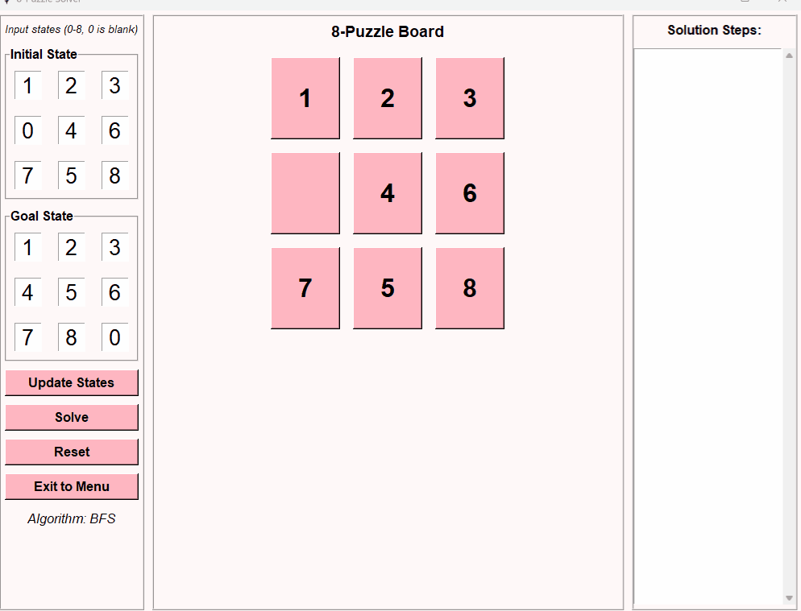

- **DFS**

  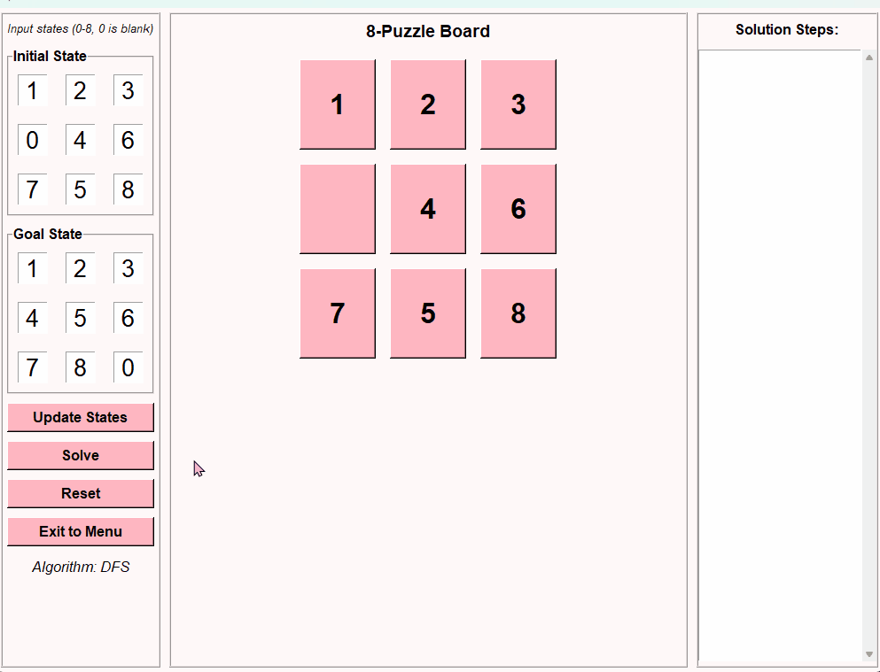

- **UCS**

  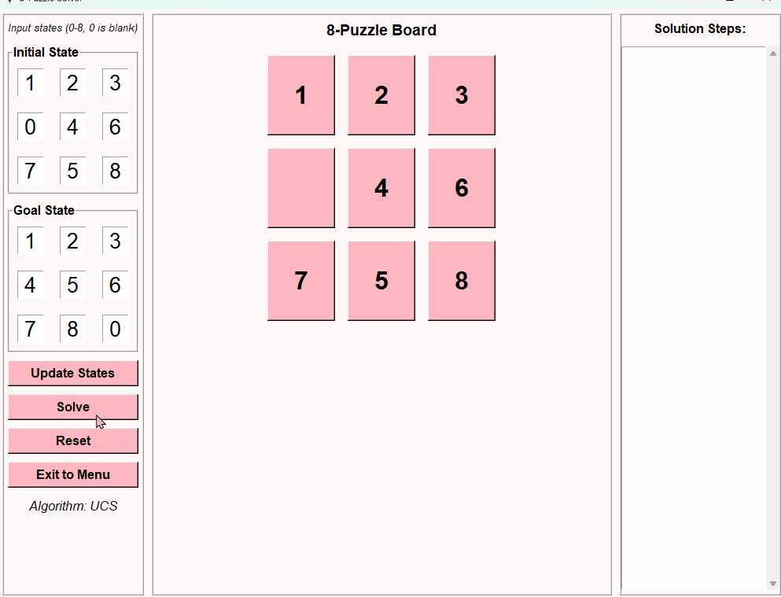

- **IDS**

  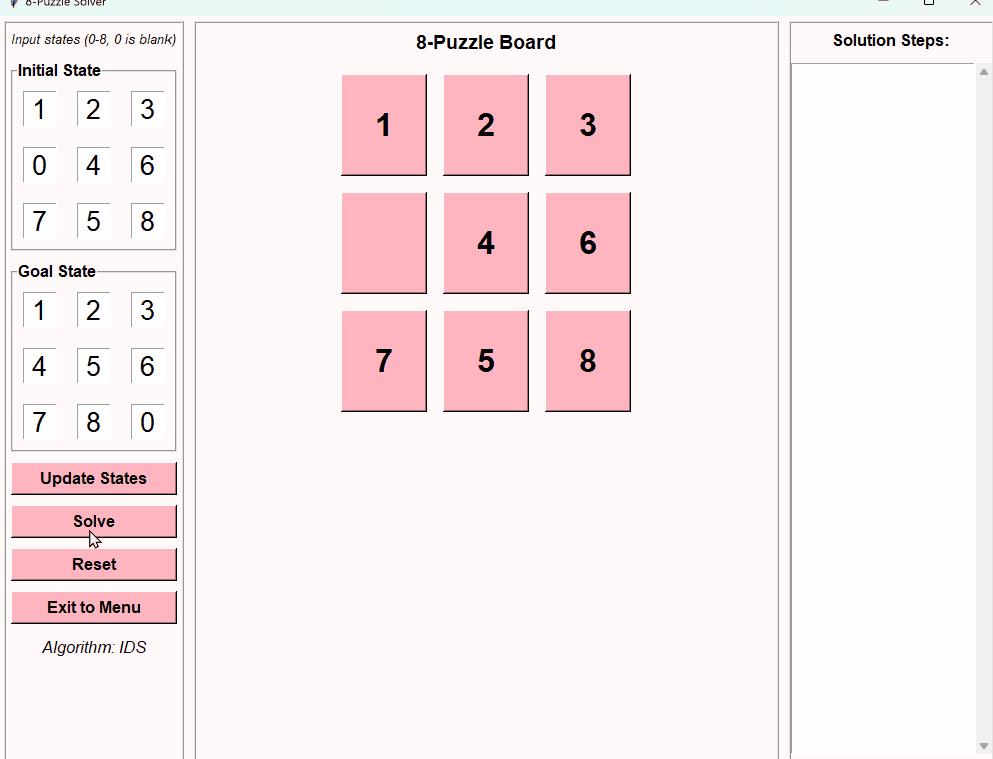

#### So sánh hiệu suất:
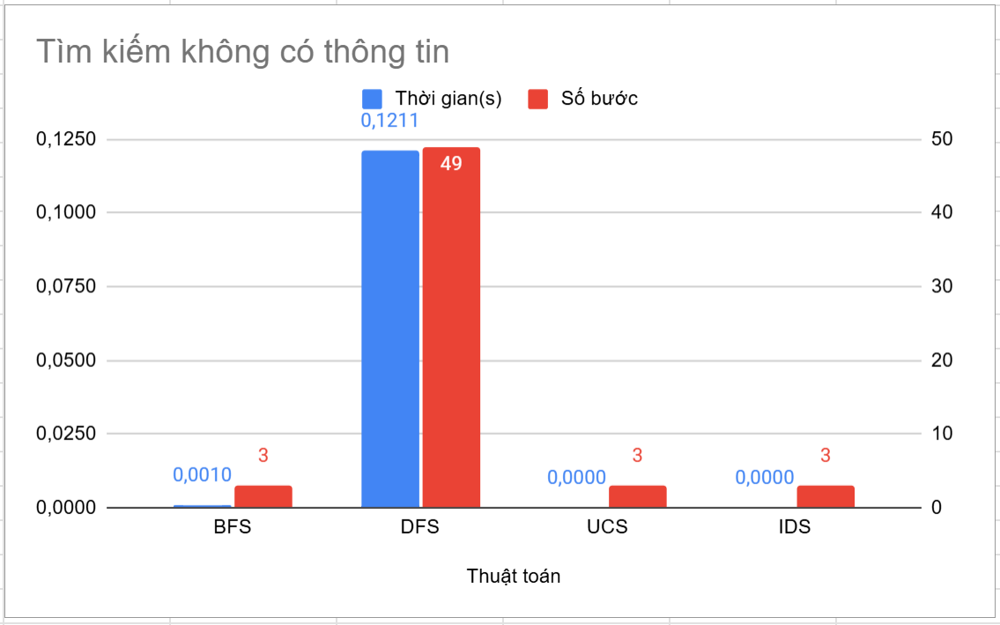

Từ biểu đồ trên, có thể rút ra một số nhận xét quan trọng về hiệu quả của các thuật toán tìm kiếm không có thông tin khi áp dụng cho bài toán 8-Puzzle:

- **BFS** và **UCS** đều tìm được lời giải tối ưu với **3 bước di chuyển**, và thời gian thực thi rất thấp (**0.0010s** và **0.0000s** tương ứng). Điều này cho thấy với bài toán có không gian trạng thái nhỏ và chi phí di chuyển đồng nhất, hai thuật toán này cực kỳ hiệu quả trong việc tìm đường đi ngắn nhất.

- **IDS** cũng đạt được kết quả tương đương về cả số bước và thời gian (**0.0000s**), mặc dù bản chất của nó là lặp lại DFS nhiều lần với độ sâu tăng dần. Điều này minh chứng cho ưu điểm về tiết kiệm bộ nhớ mà không đánh đổi chất lượng lời giải trong những bài toán nhỏ.

- **DFS**, trái lại, tỏ ra kém hiệu quả nhất: mất **49 bước** để đến đích, tức đi lòng vòng qua rất nhiều trạng thái không cần thiết. Thời gian xử lý lên đến **0.1211s**, cao hơn gấp nhiều lần các thuật toán còn lại. Nguyên nhân là do DFS không quan tâm đến độ gần mục tiêu mà chỉ tìm theo chiều sâu, dễ đi lạc và chỉ tìm thấy lời giải ngẫu nhiên.

Tóm lại, trong nhóm này, **UCS** và **BFS** là lựa chọn tối ưu nếu tài nguyên bộ nhớ cho phép, **IDS** là phương án cân bằng giữa bộ nhớ và thời gian, còn **DFS** phù hợp với bài toán có không gian nhỏ hoặc cần truy vết sâu mà không quan trọng chất lượng lời giải.

---

### 💡 2. Tìm kiếm có thông tin

#### Hình ảnh quá trình tìm kiếm:
- **A\***

  

- **IDA\***

  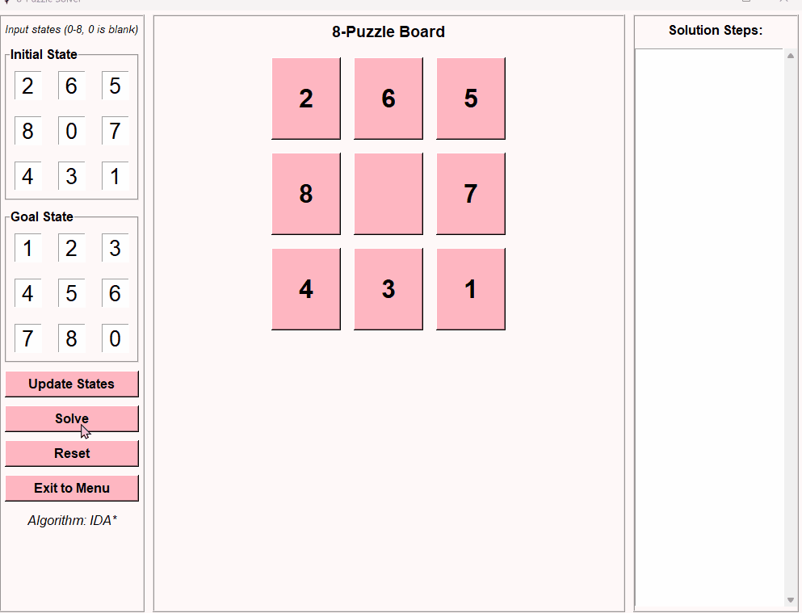

- **Greedy**

  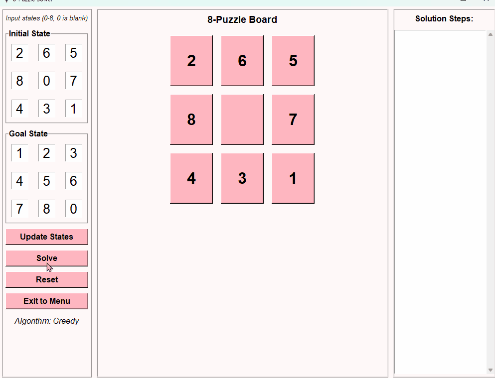

#### So sánh hiệu suất:
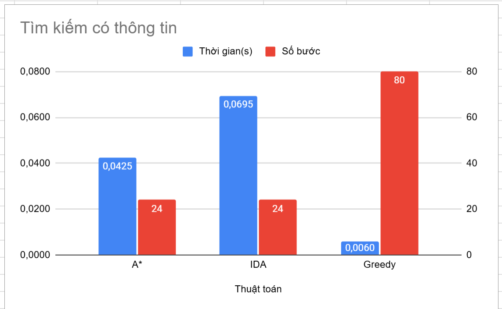

Bảng trên cho thấy hiệu quả và sự khác biệt rõ rệt giữa ba thuật toán phổ biến trong nhóm tìm kiếm có thông tin:

- **A\*** thể hiện sự cân bằng giữa chi phí và hiệu quả: chỉ cần **24 bước** để đạt mục tiêu với thời gian thực thi **0.0425 giây**. Nhờ sử dụng cả chi phí tích lũy (g(n)) và ước lượng còn lại (h(n)), A\* tìm ra đường đi ngắn nhất với hiệu năng hợp lý.

- **IDA\*** cũng đạt được số bước tương tự (**24 bước**), nhưng thời gian cao hơn một chút (**0.0695 giây**). Điều này là do IDA\* thực hiện lặp sâu dần trên chi phí f(n), dẫn đến việc mở rộng lại các nút nhiều lần, tuy nhiên vẫn duy trì tối ưu lời giải với chi phí bộ nhớ thấp hơn A\*.

- **Greedy Best-First Search** lại cực kỳ nhanh (**0.0060 giây**), vì chỉ dựa vào ước lượng h(n), không quan tâm đến chi phí đã đi. Tuy nhiên, điều này khiến nó không tìm được đường đi ngắn nhất, dẫn đến kết quả **80 bước**, dài hơn gấp 3 lần so với A\* và IDA\*.

Tóm lại, với các bài toán yêu cầu lời giải ngắn và ổn định, **A\*** là lựa chọn lý tưởng nếu bộ nhớ cho phép. **IDA\*** là sự thay thế tiết kiệm bộ nhớ, trong khi **Greedy** phù hợp với các ứng dụng cần tốc độ cao hơn là độ chính xác.

---

### 🔍 3. Tìm kiếm cục bộ

#### Hình ảnh quá trình tìm kiếm:
- **Simple Hill Climbing**

  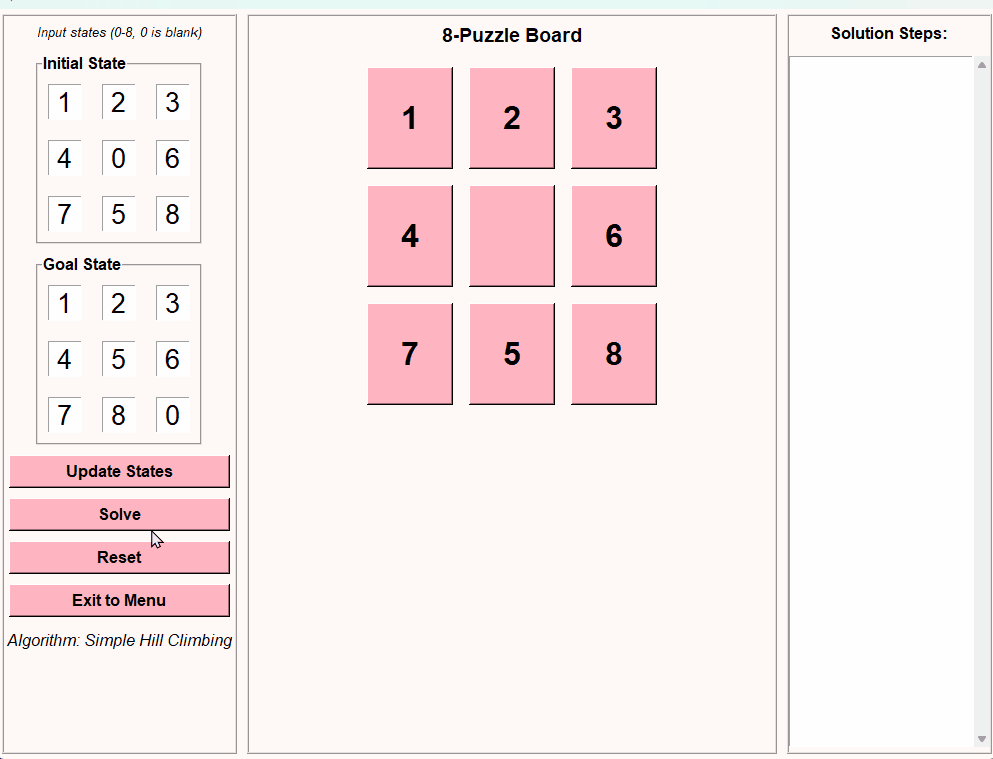

- **Steepest Ascent HC**

  

- **Stochastic HC**

  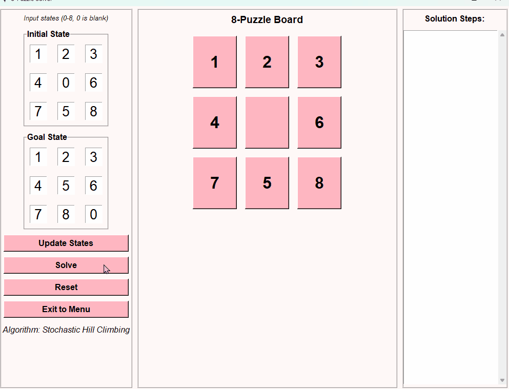

- **Simulated Annealing**

  

- **Beam Search**

  

- **Genetic Algorithm**

  

#### So sánh hiệu suất:
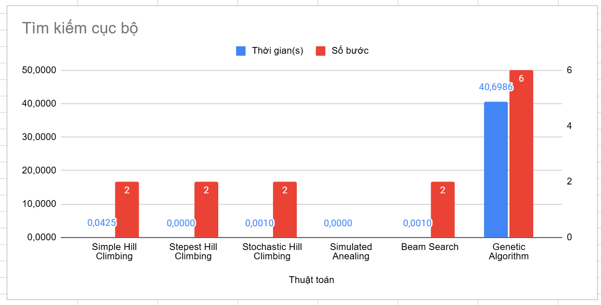

Các thuật toán tìm kiếm cục bộ cho thấy cách tiếp cận khác biệt khi chỉ tập trung cải thiện nghiệm hiện tại dựa trên lân cận:

- **Simple Hill Climbing**, **Steepest Hill Climbing** và **Stochastic Hill Climbing** đều đạt được lời giải chỉ trong **2 bước** với thời gian thực hiện rất nhỏ, cho thấy khả năng hội tụ nhanh khi trạng thái xuất phát gần với đích. Tuy nhiên, các thuật toán này dễ bị mắc kẹt ở cực trị địa phương nếu gặp trạng thái khó.

- **Simulated Annealing** không cung cấp số bước cụ thể vì bản chất xác suất của nó, đôi khi giải không thành công hoặc mất nhiều thời gian để hội tụ. Tuy nhiên, đây là thuật toán mạnh trong việc vượt qua cực trị địa phương nhờ yếu tố làm nguội dần.

- **Beam Search** kết hợp mở rộng đồng thời nhiều hướng, giúp đạt được lời giải tương đương Hill Climbing trong thời gian ngắn.

- **Genetic Algorithm** cần tới **6 bước** và thời gian rất lớn (**40.6986 giây**) do phải xử lý nhiều cá thể qua các thế hệ. Dù chậm, nhưng GA mạnh trong việc khám phá không gian tìm kiếm rộng và tránh kẹt cục bộ nếu được cấu hình đúng.

Tổng kết, các thuật toán cục bộ phù hợp với các bài toán có không gian lớn hoặc không thể duyệt toàn bộ. **Hill Climbing** phù hợp với lời giải gần đúng nhanh, còn **GA** và **Simulated Annealing** mạnh hơn trong các không gian phức tạp.

---

### 🎗️ 4. Tìm kiếm có ràng buộc

#### Hình ảnh minh họa:
- **AC-3**

  

- **Backtracking**

  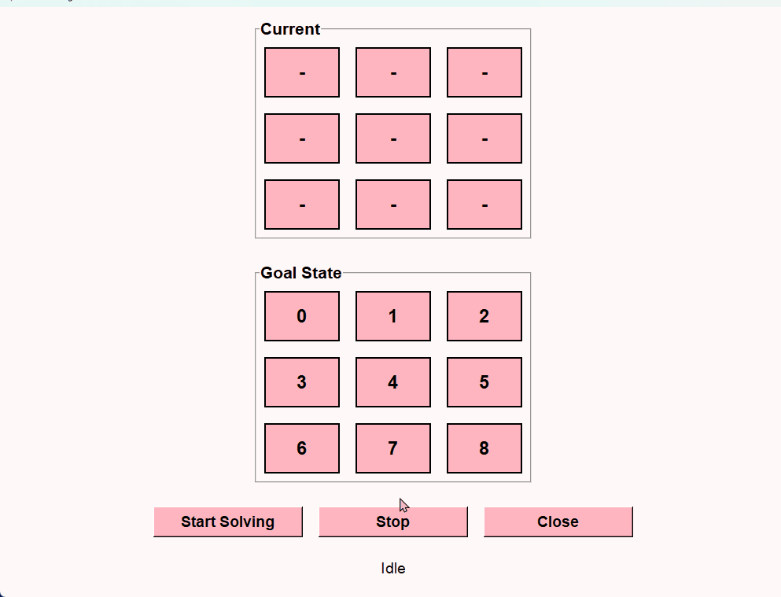

#### So sánh hiệu suất:
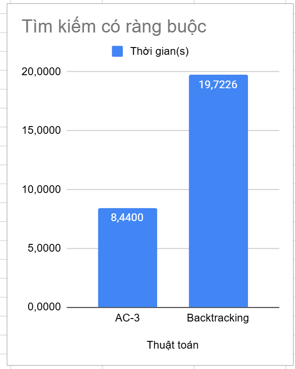

Kết quả thực nghiệm của nhóm thuật toán tìm kiếm có ràng buộc cho thấy sự khác biệt rõ rệt giữa hai hướng tiếp cận: ràng buộc cục bộ (AC-3) và quay lui toàn cục (Backtracking):

- **AC-3 (Arc Consistency 3)** là một phương pháp tiền xử lý cực kỳ hiệu quả trong việc loại trừ các giá trị không hợp lệ khỏi miền của các biến trước khi tìm kiếm, nhờ đó giúp rút gọn không gian tìm kiếm đáng kể. Với thời gian thực thi khoảng **8.4400 giây**, AC-3 tỏ ra phù hợp với các bài toán ràng buộc có độ phức tạp vừa phải hoặc cần tối ưu tốc độ kiểm tra ràng buộc trước khi kết hợp với thuật toán tìm kiếm khác.

- **Backtracking** là một kỹ thuật đơn giản nhưng rất mạnh, cho phép quay lui để thử lại các lựa chọn khác nhau khi gặp bế tắc. Tuy nhiên, vì phải duyệt theo chiều sâu toàn bộ cây không gian nghiệm mà không áp dụng tinh giản, nên thời gian thực thi lên tới **19.7226 giây**, gần gấp đôi AC-3. Điều này phản ánh rõ ràng hạn chế về hiệu suất của backtracking trong bài toán lớn hoặc nhiều ràng buộc.

Tổng kết, **AC-3** là lựa chọn tốt nếu cần rút gọn không gian tìm kiếm trước khi áp dụng chiến lược chính, còn **Backtracking** phù hợp trong các trường hợp cần kiểm soát toàn bộ quá trình sinh lời giải hoặc cần độ linh hoạt cao.

---

### 🤖 5. Tìm kiếm trong môi trường phức tạp

- **AND-OR Search**

  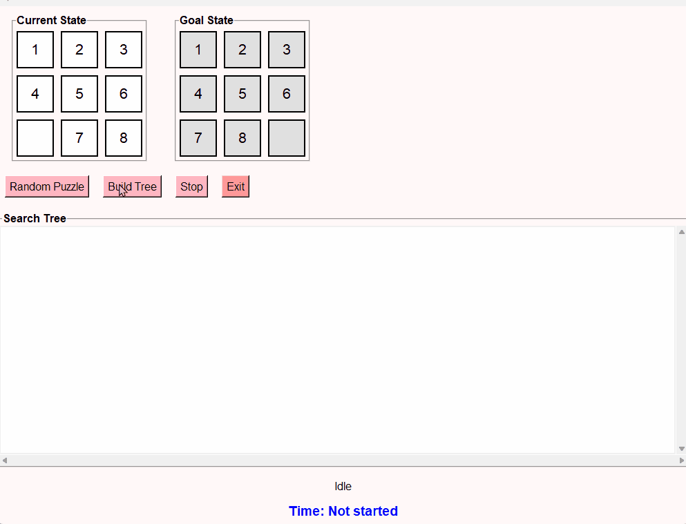

- **Search with partical observation**

  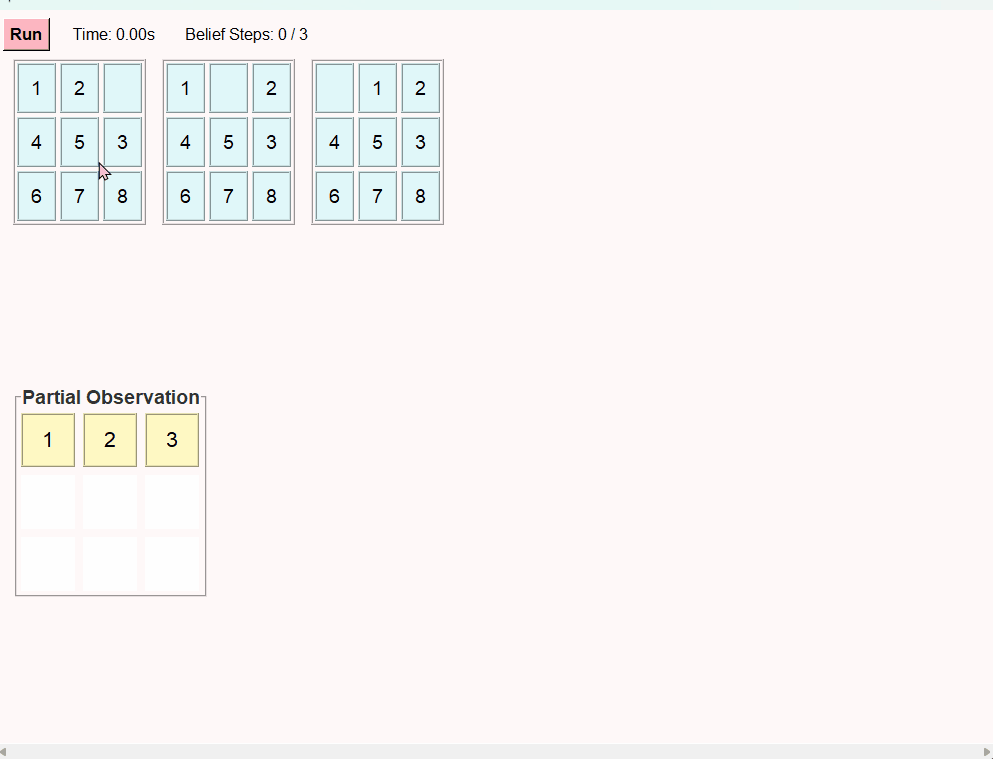
- **Search with no observation**

  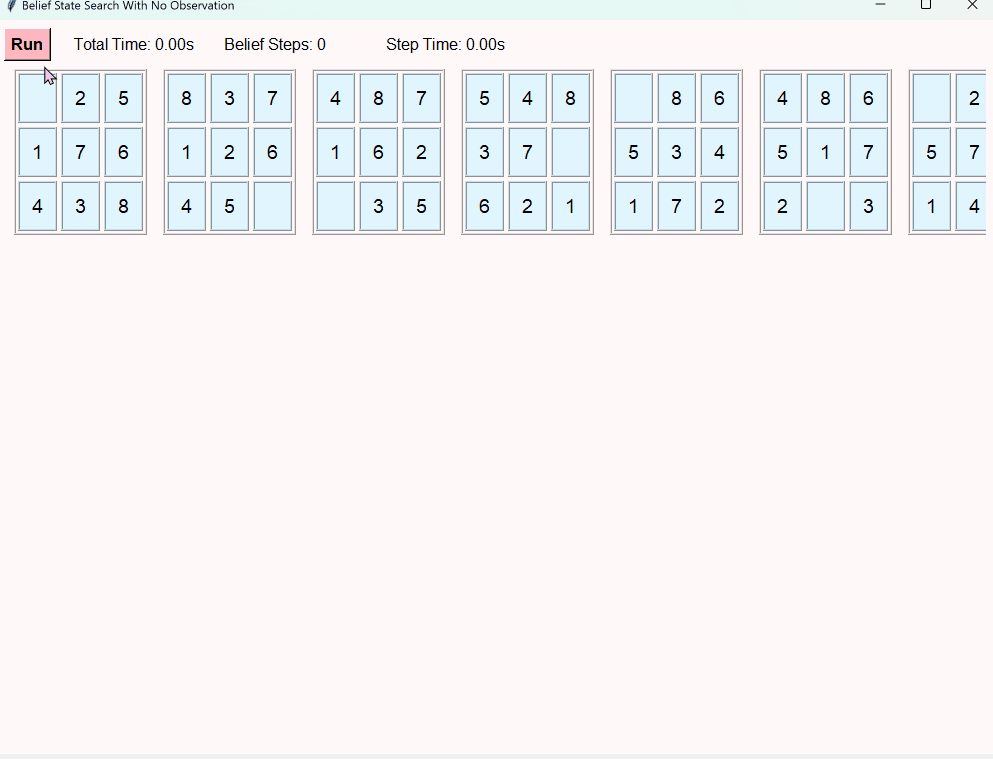

#### So sánh hiệu suất:
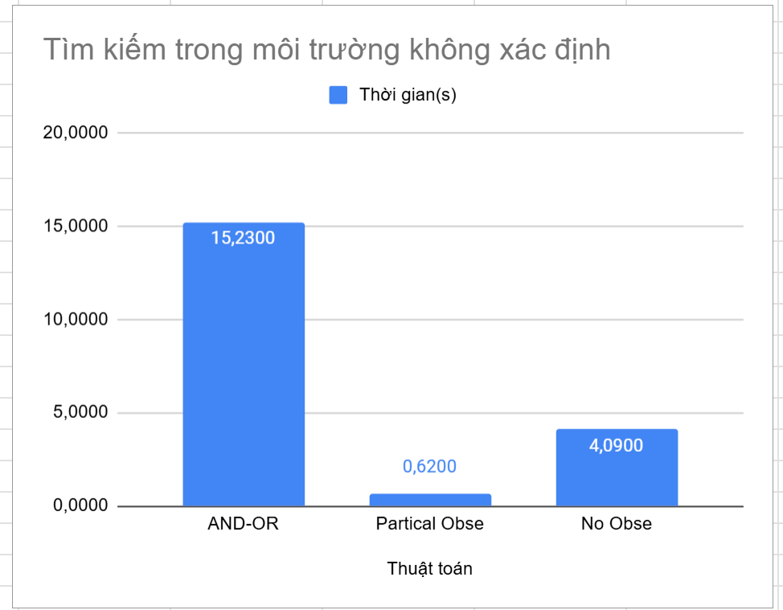

Nhóm thuật toán tìm kiếm trong môi trường không xác định mô phỏng các tình huống thực tế nơi mà thông tin về trạng thái môi trường không đầy đủ hoặc không rõ ràng. Kết quả cho thấy:

- **AND-OR Graph Search** có thời gian thực thi cao nhất (**15,2300 giây**) do đặc thù phải xử lý cây tìm kiếm phức hợp có nhánh phụ thuộc logic, phù hợp với các bài toán có điều kiện và mục tiêu phụ. Đây là thuật toán mạnh nhưng có chi phí xử lý cao.

- **Partially Observable Search** (quan sát không đầy đủ) đạt hiệu suất cao hơn rõ rệt (**0,6200 giây**). Việc giới hạn thông tin giúp giảm tải tính toán, nhưng cũng tiềm ẩn nguy cơ bỏ sót giải pháp nếu không thiết kế chiến lược tìm kiếm tốt.

- **No Observation** (không có quan sát) mất **4,0900 giây**, phản ánh sự khó khăn khi không thể cập nhật trạng thái môi trường, buộc thuật toán phải dựa vào giả định hoặc chính sách cố định, làm giảm hiệu quả.

Tổng quan, nhóm này cho thấy rõ tầm quan trọng của mức độ thông tin trong việc định hướng chiến lược tìm kiếm và ảnh hưởng trực tiếp đến thời gian giải quyết vấn đề.


### 🧠 6. Học củng cố

- **Q-Learning**

  

#### So sánh hiệu suất:
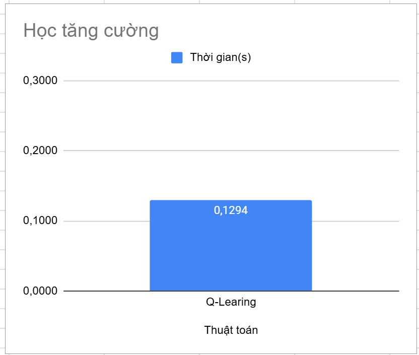

**Q-Learning** là một lựa chọn mạnh mẽ cho bài toán 8-Puzzle trong bối cảnh học tăng cường, đặc biệt khi môi trường có tính không xác định hoặc thông tin không đầy đủ. Thời gian thực thi **0.1294** giây cho thấy thuật toán này có khả năng hội tụ nhanh trong không gian trạng thái vừa phải, nhưng không thể cạnh tranh với các thuật toán tìm kiếm có thông tin hoặc không có thông tin tối ưu về tốc độ và độ chính xác (như A*, BFS).

---

## ✅ KẾT LUẬN

Sau khi triển khai và thử nghiệm các nhóm thuật toán khác nhau trên bài toán 8-puzzle, nhóm rút ra một số kết luận sau:

- **Thuật toán tìm kiếm không có thông tin** (như BFS, DFS, IDS) cho thấy hiệu quả khác nhau: BFS tìm được lời giải ngắn nhất nhưng tiêu tốn nhiều bộ nhớ, DFS nhanh nhưng không đảm bảo tối ưu, IDS là sự cân bằng giữa hai thuật toán này.
- **Thuật toán có thông tin** (A*, Greedy, IDA*) vượt trội hơn nhờ sử dụng heuristic. A* là thuật toán hiệu quả nhất về thời gian và độ chính xác, trong khi IDA* tiết kiệm bộ nhớ hơn.
- **Thuật toán cục bộ và ràng buộc** như Hill Climbing, Min-conflict cũng giải được bài toán nhưng dễ mắc kẹt ở nghiệm cục bộ.
- **Thuật toán học tăng cường** (Q-learning, SARSA) tuy tốn nhiều thời gian huấn luyện nhưng có khả năng học cách giải bài toán một cách tổng quát, đặc biệt hữu ích trong môi trường phức tạp.

Thông qua project này, nhóm đã củng cố kiến thức lý thuyết và kỹ năng lập trình thuật toán AI, đồng thời hiểu rõ hơn về cách lựa chọn giải pháp phù hợp cho từng loại bài toán cụ thể.

---

## 🚀 PREREQUISITES

- Python **3.7** trở lên  
- pip

## 🛠 INSTALLATION

```bash
git clone https://github.com/fangshipt/TTNT.git
cd TTNT 
```

## 🧷 PROJECT STRUCTURE

<pre>
TTNT/ 
├── assets/ # gifs & hình minh hoạ 
├── ac3Search.py # AC-3 algorithm 
├── backtracking.py # Backtracking CSP 
├── andor.py # AND-OR graph search 
├── partialObs.py # Partially observable search 
├── noObs.py # Non-observable search 
├── algorithm.py # Hàm mở rộng chung, priority queues… 
├── puzzlebasic.py # Lớp Puzzle 
├── main.py # CLI entrypoint 
└── requirements.txt # Dependencies</pre>


